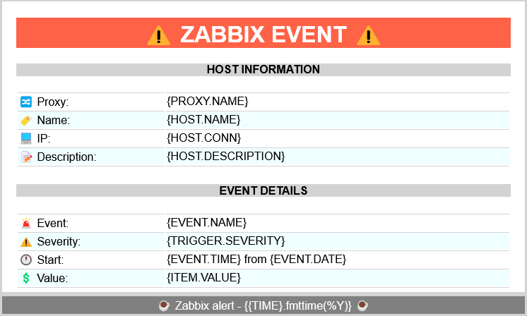
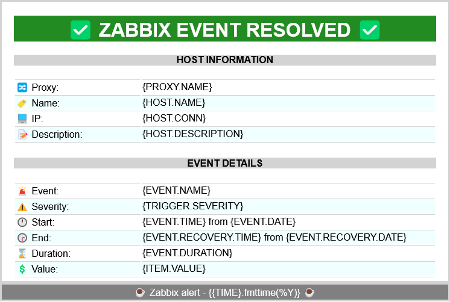

# Zabbix HTML E-mail template

Zabbix HTML Email Template for alert messages. \
This repository contains a set of customizable HTML templates for use with the Zabbix Email (HTML) media type.

 

## Requirements

- [Zabbix DB with UTF-8 encoding](https://www.zabbix.com/documentation/current/en/manual/appendix/install/db_scripts)
- [Zabbix e-mail Media Type](https://www.zabbix.com/documentation/current/en/manual/config/notifications/media/email) cofigured with the `HTML message format`

 

## Customization

You can customize many HTML tags. From the logo, trigger/host information, colors, footer, etc. \
One possible limitation is the database encoding as [not all emojis are encoded correctly](https://www.zabbix.com/forum/zabbix-cookbook/413606-coloured-html-email-notification-templates) by the database.

> - **It is recommended to use the HTML entity code for emojis. [EmojiGuide](https://emojiguide.org) can help finding the correct codes.**
> - **You can easily test the HTML code with tools such as ↗️ [W3 School HTML editor](https://www.w3schools.com/tryit/tryit.asp?filename=tryhtml_hello)**

 

## Installation

⏺️ [HTML Templates](./Template/)

↗️ [Zabbix Media Type configuration](https://www.zabbix.com/documentation/current/en/manual/config/notifications/media)

 

## Samples

 

 

# ToDo
- [ ] Add link to Event Details
- [ ] Add a Graph to the problematic item
