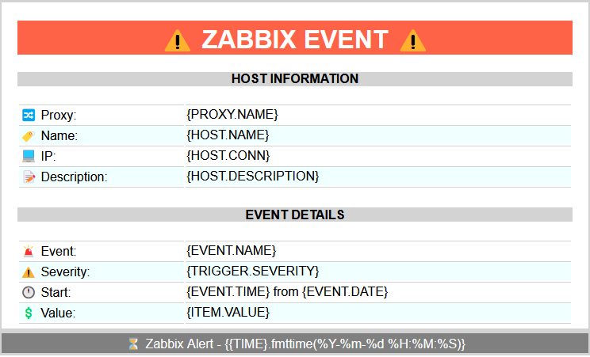
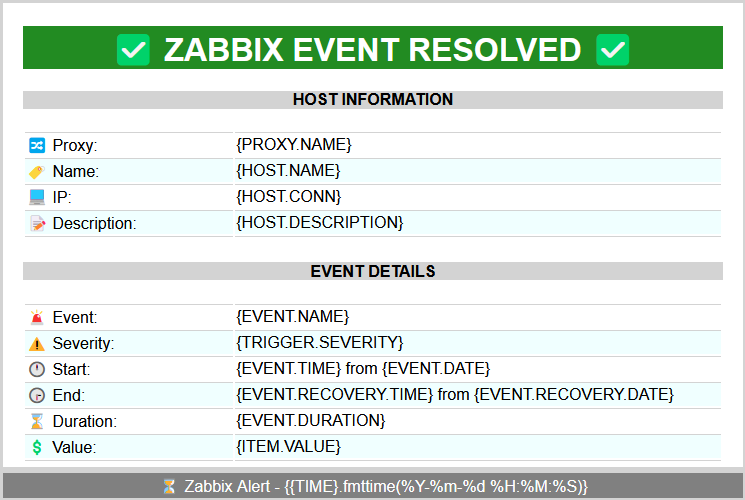
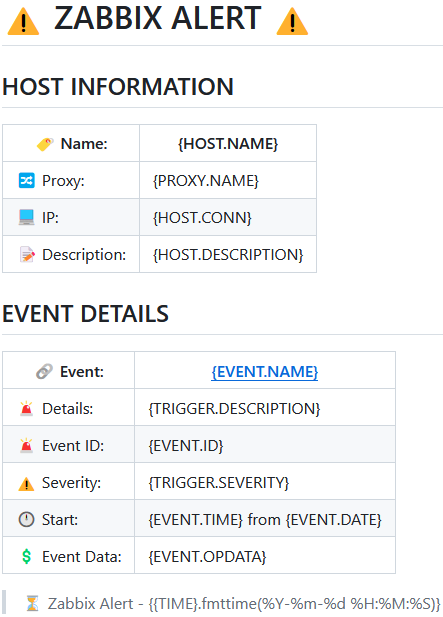
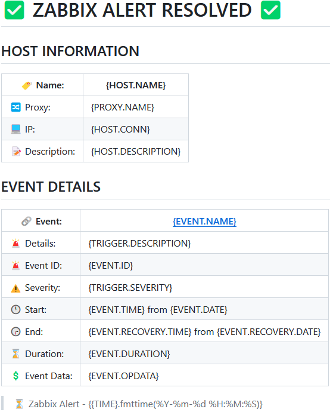

# Zabbix HTML E-mail template

This repository contains a set of customizable HTML and Markdown templates for use with a Zabbix media type.

 

## Requirements

- [Zabbix DB with UTF-8 encoding](https://www.zabbix.com/documentation/current/en/manual/appendix/install/db_scripts)
- [Zabbix Media Type](https://www.zabbix.com/documentation/current/en/manual/config/notifications/media) cofigured with the `HTML` or `Markdown` message format
- Define a `{$ZABBIX.URL}` **global macro** for message links that point to the alerted event.
  > _The URL should be either an IP address, a fully qualified domain name or localhost. See [MS Teams integration](https://www.zabbix.com/integrations/msteams) for examples._

 

## Customization

You can customize many HTML tags. From the logo, trigger/host information, colors, footer, etc. \
One possible limitation is the database encoding as [not all emojis are encoded correctly](https://www.zabbix.com/forum/zabbix-cookbook/413606-coloured-html-email-notification-templates) by the database.

> - **It is recommended to use the HTML entity code for emojis. [EmojiGuide](https://emojiguide.org) can help finding the correct codes.**
> - **You can easily test the HTML code with tools such as [↗️ W3 School HTML editor](https://www.w3schools.com/tryit/tryit.asp?filename=tryhtml_hello)**

 

## Installation
> **Copy the template and adjust it to suit your scenario. Then paste it into your media configuration.**

⏺️ [HTML Templates](./Template/html/)

⏺️ [Markdown Templates](./Template/markdown/)

> ↗️ [Zabbix Media Type configuration](https://www.zabbix.com/documentation/current/en/manual/config/notifications/media)

 

## Samples

### HTML
|  |  |
| :---: | :---: |
 

### Markdown
|  |  |
| :---: | :---: |
